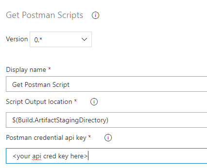
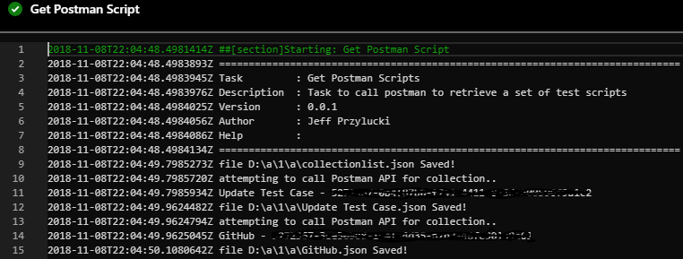

# Azure Pipeline Get Postman Scripts
TFS and Azure Pipeline task that will call the Postman API to retrieve the JSON scripts from your account and workspaces.

Utilizing this task you can leverage your Postman Enterprise account to manage your scripts, and then pull them down locally so you can put them in a Git repo for better version control.  AND/OR You can also utilize this in conjunction with the Postman Newman task in the Marketplace to pull the JSON files locally for use with that task to run your Postman scripts as part of your build and release pipeline.

## Azure Dev Ops YAML
steps: --

` steps: `
`- task: oneLuckiGetPostmanScripts@0`
  `displayName: 'Get Postman Script'`
  `inputs:`
  `fileLocation: '$(Build.ArtifactStagingDirectory)\folder'`
  `apiKey: ' -- your api cred key here --'`

## Functionality
This task will pull your Postman scripts from your Postman enterprise account.  You will need to provide the api credentials Token for the task to validate with Postman

## Input Value usage
**Script Output location**
 The Path where the retrieved JSON files should be stored.  If you want to begin managing those scripts in Git for better history tracking than what Postman provides, you can set the output to be your sources folder and then utilize a Git task to push these changes to your Git repo.

**Postman credential api key**
Your Postman API credentials Token

     

## Images

## Source
[GitHub](https://github.com/jeffpriz/get-postman-scripts)

## Issues
[File an issue](https://github.com/jeffpriz/get-postman-scripts/issues)

## Credits
[Jeff Przylucki](http://www.oneluckidev.com)